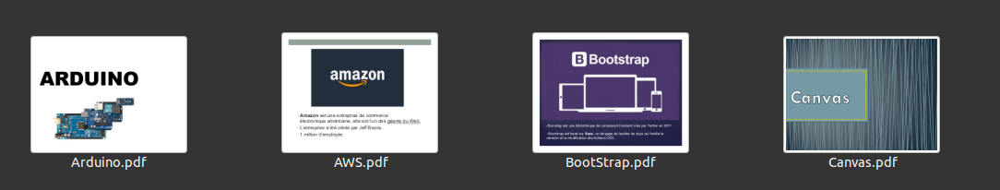

# 📽️ Veille / Tech talk 

## 📋 Subject 
* AWS
* BootStrap : https://github.com/MagaliGarot/Tech-talk/blob/master/BootStrap.pdf
* Canvas
* Arduino

# 🗒Le projet :

Réalisations et présentations de 4 veilles chez BeCode Liège.

## 🖊 A propos :

### 👩‍💻 Magali :

Actuellement en formation à BeCode Liège, je me forme avec comme objectif de décrocher un emploi dans le web développement. 

